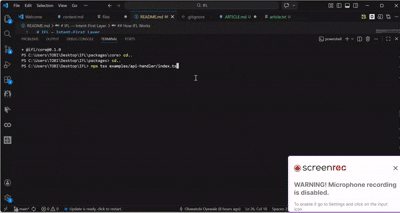

# IFL — Intent-First Layer

**IFL makes programmer intent verifiable at runtime — in the code you're already writing, with the tools you're already using.**



## Installation

```bash
npm install @ifl/core
```

## The Problem

The first 80% of any application builds fast. Modern tools, AI coding assistants, and frameworks make it easy to ship features quickly. But the last 20% is a different universe entirely — a universe of silent semantic bugs that pass all your tests, slip through code review, and surface only when a real user hits that one edge case nobody thought about.

Current debugging tools tell you WHAT happened: stack traces, variable dumps, log aggregations. But they don't tell you WHY the behavior diverged from what you intended. AI coding assistants make this worse — they generate plausible-looking code that works for the obvious cases but silently fails on the edges. You asked for "sort this array," and the AI gave you lexicographic sort instead of numeric sort. It works perfectly until someone adds the number 10.

Programmer intent evaporates the moment code is written. It becomes a comment nobody reads, a mental model that lives only in the original author's head, or worse — nothing at all. When a bug surfaces six months later, you're reverse-engineering intent from behavior, which is exactly backwards.

## How IFL Works

IFL lets you declare your function's intent as executable specifications directly in your code. The `@intent` decorator wraps your function and continuously verifies that actual behavior matches declared intent. When they diverge, IFL produces a precise causal diagnosis — not just what went wrong, but which specific part of your declared intent was violated and why.

```typescript
import { intent, isSorted, sameElements } from '@ifl/core';

const sortNumbers = intent({
  description: 'Sorts an array of numbers in ascending order',
  ensures: (input, output) => isSorted(output) && sameElements(input[0], output),
  handles: [{ when: (arr) => arr.length === 0, returns: [] }],
  onViolation: 'warn'
})((arr: number[]) => {
  return arr.sort(); // BUG: lexicographic sort
});

sortNumbers([10, 2, 1]);
// Output:
// ━━━━━━━━━━━━━━━━━━━━━━━━━━━━━━━━━━━━━━━━
// INTENT VIOLATION — sortNumbers
// ━━━━━━━━━━━━━━━━━━━━━━━━━━━━━━━━━━━━━━━━
// Type: postcondition
// Suggested fix: Verify the sort comparator...
// Confidence: 90%
// ━━━━━━━━━━━━━━━━━━━━━━━━━━━━━━━━━━━━━━━━
```

## Quick Start

```bash
npm install @ifl/core
```

```typescript
import { intent, isSorted } from '@ifl/core';

const mySort = intent({
  ensures: (input, output) => isSorted(output)
})((arr: number[]) => {
  return [...arr].sort((a, b) => a - b);
});
```

## TypeScript Configuration

Add these to your `tsconfig.json`:

```json
{
  "compilerOptions": {
    "experimentalDecorators": true,
    "emitDecoratorMetadata": true,
    "useDefineForClassFields": false
  }
}
```

## Intent Declaration API

| Field | Type | Description | Default |
|-------|------|-------------|---------|
| `ensures` | `(input: TInput, output: TOutput) => boolean` | Postcondition — must be true after function executes | — |
| `requires` | `(...input: TInput) => boolean` | Precondition — must be true before function executes | — |
| `handles` | `Array<{ when: (...input) => boolean, returns: TOutput }>` | Edge case specifications with expected outputs | `[]` |
| `description` | `string` | Human-readable description of intent | — |
| `samplingRate` | `number` | Fraction of calls to verify (0-1) | `1.0` in dev, `0.01` in prod |
| `onViolation` | `'throw' \| 'warn' \| 'log' \| (violation) => void` | What to do when intent is violated | `'warn'` in dev |
| `tags` | `string[]` | Tags for filtering in CLI | `[]` |

## Built-in Property Helpers

### Array Helpers

| Helper | Description |
|--------|-------------|
| `isSorted(arr, comparator?)` | Array is sorted (optionally with custom comparator) |
| `sameElements(a, b)` | Two arrays contain the same elements (any order) |
| `isUnique(arr)` | Array has no duplicate elements |
| `isNonEmpty(arr)` | Array has at least one element |
| `containsAll(arr, required)` | Array contains all required elements |
| `isSubsetOf(arr, superset)` | All elements in arr exist in superset |
| `allMatch(arr, predicate)` | All elements satisfy predicate |
| `noneMatch(arr, predicate)` | No elements satisfy predicate |
| `isSortedBy(arr, key)` | Array of objects is sorted by key |

### String Helpers

| Helper | Description |
|--------|-------------|
| `isEmail(str)` | Valid email format |
| `isUrl(str)` | Valid URL format |
| `isJson(str)` | Parseable as JSON |
| `isNonEmpty(str)` | String has at least one character |
| `hasMinLength(str, min)` | String has at least min characters |
| `hasMaxLength(str, max)` | String has at most max characters |
| `matches(str, pattern)` | String matches regex pattern |
| `isOneOf(str, options)` | String is one of the allowed values |
| `isAlphanumeric(str)` | String contains only letters and numbers |

### Number Helpers

| Helper | Description |
|--------|-------------|
| `isPositive(n)` | Number is greater than zero |
| `isNonNegative(n)` | Number is zero or greater |
| `isInRange(n, min, max)` | Number is within inclusive range |
| `isInteger(n)` | Number is an integer |
| `isFiniteNumber(n)` | Number is finite (not Infinity or NaN) |
| `isProportion(n)` | Number is between 0 and 1 inclusive |
| `isPercentage(n)` | Number is between 0 and 100 inclusive |

### Object Helpers

| Helper | Description |
|--------|-------------|
| `hasRequiredFields(obj, fields)` | Object has all required fields |
| `isDeepEqual(a, b)` | Two values are deeply equal |
| `isNonNull(value)` | Value is not null or undefined |
| `isValidShape(obj, schema)` | Object matches type schema |
| `satisfiesAll(obj, predicates)` | Object satisfies all predicates |

## Verifying AI-Generated Code

IFL solves the "AI slop" problem — code that looks correct, passes obvious tests, but fails on edge cases.

### The Workflow

1. **Write the intent declaration first** — describe what you want, not how to do it
2. **Ask AI to generate the implementation** — Copilot, ChatGPT, Claude, whatever
3. **Run verification**: `npx ifl verify --interactive`
4. **Paste intent + code** — get immediate ACCEPT or REJECT verdict

### Programmatic Verification

```typescript
import { aiVerifier } from '@ifl/core';

const result = await aiVerifier.verifyGeneratedCode({
  code: aiGeneratedFunction,
  intentDeclaration: myIntent,
  functionName: 'solution',
  runs: 100
});

console.log(result.recommendation); // 'accept' | 'reject' | 'review'
console.log(result.reasoning);      // Human-readable explanation
console.log(result.confidence);     // 0-1 confidence score
```

## CLI Usage

```bash
# Check all intent declarations in a file
npx ifl check src/payments.ts

# Check with more fuzz test runs
npx ifl check src/payments.ts --runs 500

# Interactive AI code verification
npx ifl verify --interactive
```

## The 80/20 Problem: Before and After

| Without IFL | With IFL |
|-------------|----------|
| Expired card returns `'completed'` — found in production by user complaint | Expired card returns `'completed'` — caught instantly with full causal trace |
| Cart total not recalculated after item removal — silent wrong state for hours | Cart total invariant violated — caught on the exact state transition |
| AI generates plausible-but-wrong pagination logic — ships to prod | AI code runs against intent declaration — rejected before merge |
| "It worked on my machine" — bug only manifests with specific inputs | Fuzz testing catches the failing pattern automatically |

## Configuration

### Sampling Rate

In development, IFL checks every function call by default (`samplingRate: 1.0`). In production, it samples 1% of calls (`samplingRate: 0.01`) to minimize overhead.

```typescript
const fn = intent({
  ensures: (input, output) => output.isValid,
  samplingRate: process.env.NODE_ENV === 'production' ? 0.001 : 1.0
})((data) => process(data));
```

### Violation Handling Modes

| Mode | Behavior | Use Case |
|------|----------|----------|
| `'throw'` | Throws `IntentViolationError` | Tests, critical paths |
| `'warn'` | `console.warn` with formatted report | Development |
| `'log'` | `console.log` with formatted report | Production monitoring |
| `(violation) => void` | Custom handler function | Logging services, alerting |

## Philosophy

A programming language tells you what happened. A stack trace tells you where it happened. But neither tells you what was *supposed* to happen. IFL bridges that gap by making programmer intent a first-class, executable artifact.

The gap between "what happened" and "what was supposed to happen" is where all the hard bugs live.

## License

MIT
